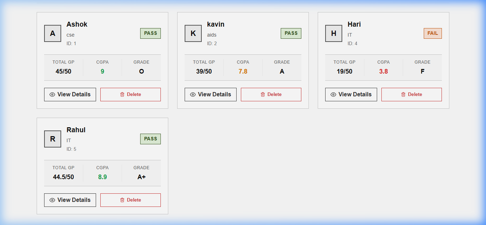
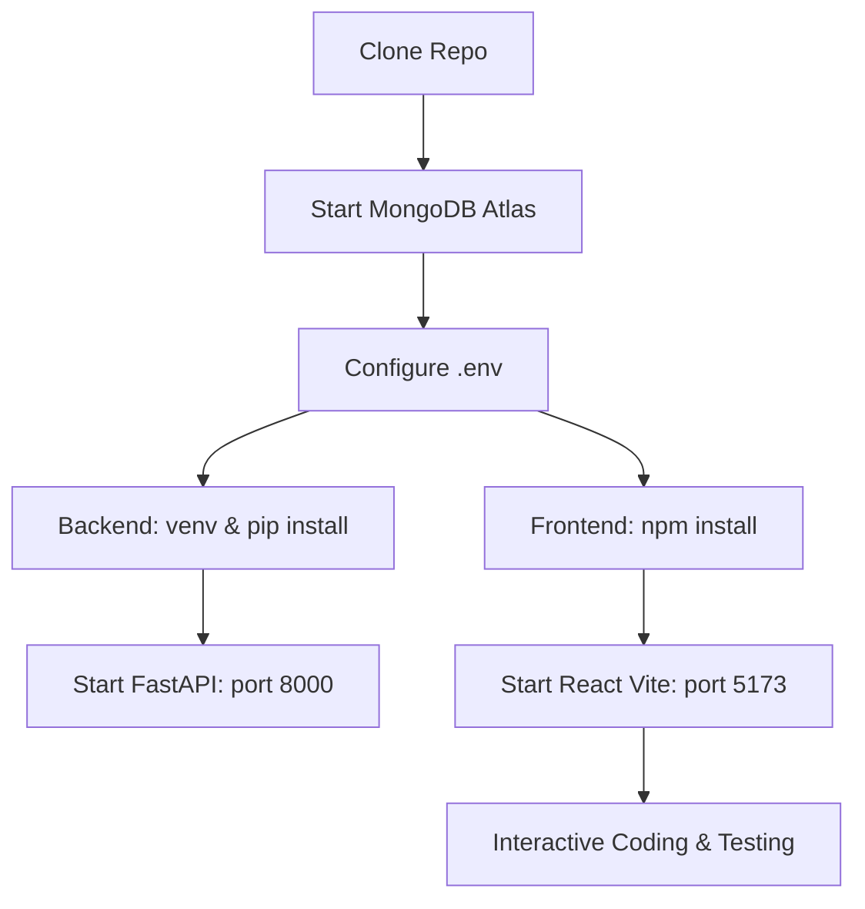

# Student Result Dashboard 🎓

A modern, responsive, and minimalist web application designed for students and educators to view, manage, and calculate grade results using a unified **10-point CGPA scale**. Built with **FastAPI**, **React (Vite)**, and **MongoDB**.



---

## ✨ Features

- **Flat, Clean UI**: High-legibility classical stylesheet (no unnecessary animations or dark-mode overhead).
- **10-Point CGPA System**: Standard grading points system from `0.0` to `10.0` for 5 core subjects:
  - Mathematics, Physics, Chemistry, English, and Computer Science.
- **Pass/Fail Threshold**: Individual subject passing limits set to `>= 4.0`. The overall result dynamically shows `"Pass"` only if all subjects are cleared.
- **Auto-Calculated Statistics**: Displays **Total GP** (out of 50), overall **CGPA** (average of 5 subjects), and **Grade Labels** (`O`, `A+`, `A`, `B+`, `B`, `C`, `F`).
- **Department Filtering**: Quick tabbed navigation to view students by department (e.g. CSE, AIDS, IT).
- **Fast Search**: Instant search by Student Name, ID, or Department.
- **Full CRUD Support**: Add, view details, search, filter, and delete student records with reactive state updates.

---

## 🛠️ Tech Stack

- **Backend**: FastAPI (Python), PyMongo (MongoDB driver), Pydantic (data validation).
- **Frontend**: React 18, Vite, Axios, React Router Dom (v6), React Icons (Feather Icons).
- **Database**: MongoDB Atlas.

---

## 🚀 Suggested Development Workflow

Follow this workflow to set up, develop, and deploy the application.



### 1. Database Configuration
Create a `.env` file in the root directory with the following structure:
```env
MONGO_URL=mongodb+srv://<username>:<password>@cluster.mongodb.net/?retryWrites=true&w=majority
DB_NAME=student_result
```

### 2. Backend Setup & Run
Open a terminal in the root directory:
```bash
# Create a virtual environment
python -m venv venv

# Activate the virtual environment
# On Windows (PowerShell):
.\venv\Scripts\Activate.ps1
# On Linux / macOS:
source venv/bin/activate

# Install Python dependencies
pip install -r requirements.txt

# Start the FastAPI server on port 8000 (with hot-reload)
python -m uvicorn app.main:app --port 8000 --reload
```
*Backend API Docs will be available live at `http://127.0.0.1:8000/docs`.*

### 3. Frontend Setup & Run
Open a separate terminal inside the `app/frontend/` directory:
```bash
# Install npm packages
npm install

# Start the Vite development server on port 5173
npm run dev
```
*The React application will be accessible at `http://localhost:5173/`.*

---

## 🎓 Grading Reference Scale

| CGPA Range | Grade | Description |
| :--- | :---: | :--- |
| `9.0 – 10.0` | **O** | Outstanding |
| `8.0 – 8.9` | **A+** | Excellent |
| `7.0 – 7.9` | **A** | Very Good |
| `6.0 – 6.9` | **B+** | Good |
| `5.0 – 5.9` | **B** | Above Average |
| `4.0 – 4.9` | **C** | Pass |
| `< 4.0` | **F** | Fail / Re-appear |

---

## 📂 Codebase Directory Structure

```
├── app/
│   ├── database/        # MongoDB connection handler
│   ├── models/          # Pydantic data schemas
│   ├── routers/         # API endpoints (GET, POST, PUT, DELETE)
│   ├── schemas/         # Serialization, total calculations & pass/fail logic
│   ├── services/        # Database CRUD handlers (MongoDB query logic)
│   ├── frontend/        # React + Vite application
│   │   ├── src/
│   │   │   ├── components/ # Shared visual components & Page views
│   │   │   ├── services/   # Frontend API service layer (Axios calls)
│   │   │   ├── styles/     # Unified app stylesheet
│   │   │   └── App.jsx     # App router layout
│   └── main.py          # FastAPI application entry with CORS middleware
├── requirements.txt     # Python backend dependencies
└── README.md            # Project documentation & layout
```
